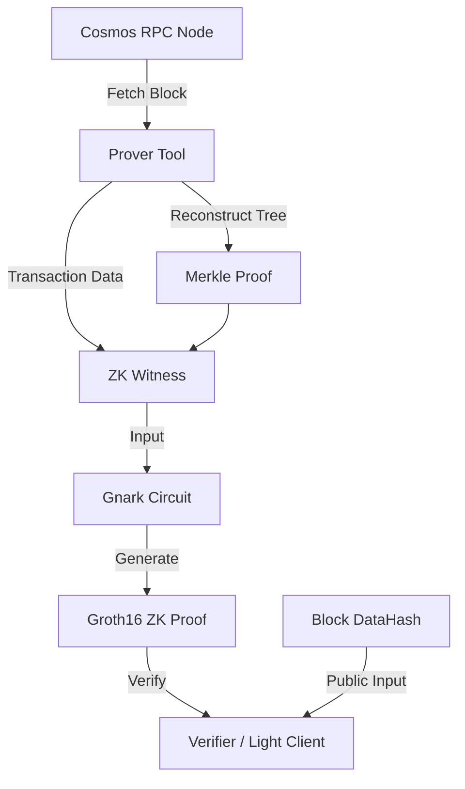

# ZK Transaction Verification for Cosmos SDK

This project implements a Zero-Knowledge (ZK) proof system to verify transaction inclusion in a Cosmos SDK block, following the CometBFT (Tendermint) Merkle tree specification.

## High-Level Architecture

The system follows a classic ZK-inclusion proof architecture, adapted for the Cosmos SDK ecosystem.



### 1. Data Retrieval & Merkle Proof
- **Source**: Fetches the full block from a Cosmos RPC node.
- **Merkle Tree**: Tendermint uses a binary Merkle tree following **RFC 6962**.
- **Proof**: Reconstructs the tree from all transactions in the block to get the "aunts" (sibling hashes) for the target transaction.

### 2. ZK Circuit (The "How")
The circuit verifies the following logic inside the ZK proof:
1. **Transaction Hashing**: `txHash = SHA256(Transaction)` (CometBFT hashes txs before tree inclusion).
2. **Leaf Hashing**: `leafHash = SHA256(0x00 || txHash)` (RFC 6962 leaf prefix).
3. **Path Reconstruction**: For each level in the proof, it computes `H(0x01 || left || right)` where one of the nodes is the current hash and the other is a proof sibling.
4. **Root Validation**: The final computed hash must equal the **DataHash** from the block header.

### 3. Gnark Framework
We use [gnark](https://github.com/Consensys/gnark) to define this logic as a set of mathematical constraints (R1CS).
- **Prover**: Compiles the circuit and generates a Groth16 proof.
- **Verifier**: A lightweight function that checks the proof against the public `DataHash`.

## Components

### 1. Merkle Verification Logic
- [merkle/verify.go](./merkle/verify.go): Standard Go implementation of RFC 6962 Merkle verification.
- [circuit/inclusion.go](./circuit/inclusion.go): Gnark circuit for verifying transaction inclusion.

### 2. Prover Tool
- [cmd/prover/main.go](./cmd/prover/main.go): A CLI tool that fetches data, reconstructs the Merkle tree, and generates/verifies ZK proofs.

## How to Use

### Build the Prover
```bash
go build -o prover ./cmd/prover/main.go
```

### Generate and Verify a ZK Proof
You can provide either a transaction index or a transaction hash.

```bash
# By index
./prover http://localhost:26657 3139 0

# By hash
./prover http://localhost:26657 3139 f73ad88058bd8d7dc9d5771ae6b86898665b98b7c403613602cb48b7efc81bda
```

## Verification Results

### Unit Tests
```bash
go test -v ./circuit/inclusion_test.go ./circuit/inclusion.go
```

### Prover Run
```
Found transaction at index 0: f73ad88058bd8d7dc9d5771ae6b86898665b98b7c403613602cb48b7efc81bda
Reconstructing Merkle proof...
Compiling circuit...
Generating ZK proof...
Verifying ZK proof...
Success! ZK proof verified.
```
