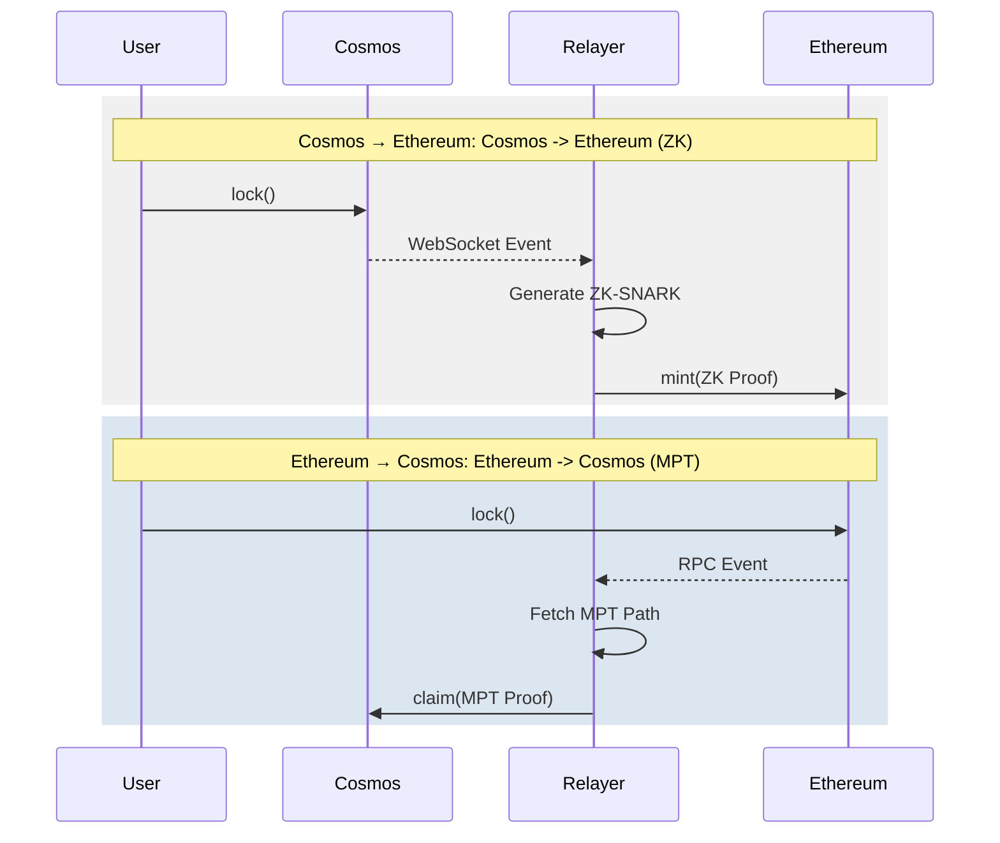

# Cosmos-Eth Bridge: Technical Architecture

This document provides a deep dive into the cryptographic and structural architecture of the bidirectional Cosmos-Eth Bridge between Cosmos (EVM) and Ethereum.

## 1. Unified Project Structure

```
bridge/
├── cmd/                    # Executable commands
│   ├── setup/             # ZK circuit compilation & key generation
│   └── relayer/           # Dual-direction bridge relayer
├── contracts/             # Solidity smart contracts
│   ├── CosmosBridge.sol   # Gateway on Cosmos EVM
│   ├── EthBridge.sol      # Gateway on Ethereum
│   ├── LibMPT.sol         # MPT verification library (for Eth -> Cosmos)
│   └── Verifier.sol       # ZK verifier (for Cosmos -> Eth)
├── pkg/                   # Shared Go packages
│   ├── circuits/          # GNARK ZK-SNARK definitions
│   ├── prover/            # Proof generation (ZK & MPT)
│   ├── rpc/               # Multi-chain RPC clients
│   └── trie/              # MPT implementation for Go
└── keys/                  # Proving/Verifying keys (Groth16)
```

---

## 2. Asset & Token Flow

The bridge facilitates the transfer of native assets and their wrapped counterparts across chains.

| Chain | Primary Native Asset | Wrapped Asset (from peer) |
|-------|----------------------|---------------------------|
| **Cosmos** | TEST (Native) | Wrapped ETH (WETH) |
| **Ethereum** | ETH (Native) | Wrapped TEST (WTEST) |

- **Locking**: Users escrow native assets (e.g., ETH on Ethereum) to mint wrapped versions on the destination (e.g., WETH on Cosmos).
- **Burning**: Users burn wrapped assets (e.g., WTEST on Ethereum) to unlock the original native assets (e.g., TEST on Cosmos).

---

## 3. Cosmos → Ethereum (ZK-SNARK)

This direction uses **Groth16 ZK-SNARKs** to verify Tendermint Merkle proofs on Ethereum.

### 3.1 Cryptographic Foundation
- **Proving System**: Groth16 (BN254 curve).
- **Circuit Logic**: Verifies that a transaction is included in the `data_hash` (Merkle Root) of a Cosmos block header.
- **Witness Reduction**: Uses **Pedersen Commitments** with a **Keccak256 transcript** to reduce public inputs, ensuring gas-efficient on-chain verification.
- **Input Packing**: 32-byte hashes are split into 4x `uint64` to maintain compatibility between the SNARK field and EVM words.

### 3.2 Deep Dive: The ZK Process

#### A. Merkle Tree Implementation (Tendermint Style)
Tendermint uses a specific hashing scheme to prevent parity attacks (second-preimage attacks):
- **Leaf Nodes**: Hashed as `SHA256(0x00 || data)`
- **Internal Nodes**: Hashed as `SHA256(0x01 || left || right)`
The circuit implements this exact logic to ensure compatibility with real Tendermint proofs.

#### B. Circuit Logic: Variable-Depth Support
The circuit is designed for a max depth of 32. To handle different proof lengths without revealing the exact depth or bloating the circuit:
1. The circuit performs a constant 32 hash iterations.
2. An `ActualDepth` private witness determines when hashing is "active".
3. `api.Select` masks dummy inputs if the index exceeds `ActualDepth`.

#### C. Pedersen Commitments & Witness Reduction
To save gas, we don't pass the Merkle Path as public inputs:
- **Problem**: 32 levels of path data would cost millions in gas.
- **Solution**: We treat path data as **private witnesses** and commit to them via Pedersen commitments.
- **Alignment**: We use `Keccak256` for the commitment transcript, allowing the Solidity verifier to verify the commitment using the native `keccak256` opcode.

#### D. Public Input Packing (4x uint64)
EVM works with 256-bit words, but SNARKs often prefer smaller chunks to avoid field overflow.
- A 32-byte hash (Root/TxHash) is split into four 64-bit unsigned integers.
- `EthBridge.sol` implements `unpack` logic to reconstruct these values for the circuit.

#### E. Public Input Slots (8 Slots)
The Solidity verifier receives 8 `uint256` inputs in order:
- `[0..3]`: **Merkle Root** (4x uint64)
- `[4..7]`: **Transaction Hash** (4x uint64)
The contract packs these dynamically from the 32-byte `bytes32` value before the `Verifier.sol` call.

---

### 3.3 Ethereum Event Detection
the relayer monitors the following `keccak256` topic hashes:
| Event | Signature | Topic Hash (Hex) |
|-------|-----------|------------------|
| `Locked` | `Locked(address,uint256,string,uint256)` | `0xb754...` |
| `Burned` | `Burned(address,uint256,string,uint256)` | `0xcd51...` |

---
1. **Circuit**: Reconstructs the Merkle tree path using SHA256 (Tendermint-style hashing).
2. **Commitment**: Prover commits to the private proof path.
3. **On-Chain**: `EthBridge.sol` calls `Verifier.sol`, passing the root, txHash, and commitment evidence.
4. **Finality**: Successfully verified proofs trigger the `mint` or `unlock` functions on Ethereum.

---

## 4. Ethereum → Cosmos (MPT-Proof)

This direction uses **Merkle Patricia Trie (MPT)** verification, leveraging the fact that Ethereum's `receiptsRoot` is natively verifiable without heavy ZK circuits.

### 4.1 Trustless Verification via LibMPT
Instead of a ZK proof, the relayer provides a raw MPT inclusion proof extracted from the Ethereum transaction receipt.

- **Storage**: The `CosmosBridge.sol` maintains a `trustedEthReceiptRoot` (the `receiptsRoot` of an Ethereum block).
- **Verified Inclusion**: All **bridge payloads are cryptographically verified on-chain**.
- **Library**: `LibMPT.sol` implements actual Merkle Patricia Trie traversal (Branch, Extension, Leaf nodes) and Keccak256 hash-chain verification.
- **Decoding**: `RLPReader.sol` is used to decode the Ethereum receipt, ensuring the `Locked` or `Burned` event signature and emitter address are valid before minting/unlocking assets.
- **Node Hashing**: Every intermediate hash in the proof MUST match the child pointer of the previous node, starting from the `trustedEthRoot`.

### 4.2 Behind the Scenes: The Verification Pipeline

The Ethereum -> Cosmos bridge performs a multi-stage cryptographic check inside **CosmosBridge.sol** to ensure no invalid assets are minted:

#### Stage 1: Inclusion Verification (`LibMPT.sol`)
1. **The Trust Anchor**: The relayer periodically updates the `trustedEthReceiptRoot` on Cosmos. This root represents the state of ALL transactions in a specific Ethereum block.
2. **Path Finding**: The relayer provides the RLP-encoded index of the transaction (the "Key").
3. **The Walk**: `LibMPT` starts at the `trustedEthReceiptRoot` and performs a hash-chain walk through the provided proof nodes. It verifies every step:
   - For a **Branch Node**, it selects the child hash matching the current nibble of the key.
   - For an **Extension Node**, it validates the partial path prefix.
   - It hashes every node (`keccak256`) and ensures it matches the pointer from the parent.
4. **Result**: If the walk is valid, it returns the raw, RLP-encoded Ethereum Receipt.

#### Stage 2: Payload Analysis (`RLPReader.sol`)
Once the raw receipt is isolated, it must be "decoded" to verify the payload:
1. **EIP-2718 Handling**: Modern Ethereum uses typed receipts (Type 1/2/3). The verifier detects these by checking if the first byte is `< 0x80`. If so, it strips the type byte to expose the actual RLP payload.
2. **List Parsing**: `RLPReader` parses the receipt list to find the `logs` array (index 3).
3. **Event Filtering**: It iterates through the logs to find one that matches:
   - **Emitter**: The log MUST come from the specific address of the `EthBridge` contract.
   - **Topic**: The first topic MUST be the Keccak256 hash of the `Locked()` or `Burned()` event signature.
   - **Data**: It extracts the amount and recipient from the log data and verifies they match the user's claim.

### 4.3 Relayer Operations & Persistence
The relayer manages the lifecycle of these proofs:
- **Block Tracking**: It maintains a `last_eth_block.txt` file to ensure that even after a restart, it picks up exactly where it left off, avoiding duplicate proof calculations.
- **WebSocket Sync**: It uses real-time event monitoring on Cosmos while using persistent polling on Ethereum to guarantee reliability.



### 4.4 Comparison of Mechanisms

| Feature | Cosmos -> Ethereum | Ethereum -> Cosmos |
|---------|-------------------|-------------------|
| **Proof Type** | ZK-SNARK (Groth16) | MPT Inclusion Proof |
| **Verifier** | `Verifier.sol` (Generated) | `LibMPT.sol` (Static) |
| **Trust Anchor** | Block `data_hash` | Block `receiptsRoot` |
| **Gas Cost** | Constant (~250k gas) | Linear to proof depth |
| **Complexity** | High (Circuit based) | Medium (RLP decoding) |

---

## 5. Key Design Decisions

### 5.1 Keccak256 Alignment
To avoid "cross-chain friction," the Go prover and Solidity contracts are strictly aligned on Keccak256. This is especially critical for the ZK-SNARK direction, where the Pedersen commitment MUST use the same Keccak hash as Ethereum's native `keccak256` opcode.

### 5.2 Robust Path Resolution
All binaries (setup, relayer) implement dynamic path detection. By locating `go.mod`, they resolve the project root, ensuring that `keys/` and `contracts/` are accessible regardless of the execution context.

### 5.3 Automated Root Synchronization (The "Synchronizer" Pattern)
The relayer acts as a "Trust Synchronizer":
- **Detection**: It monitors block headers on both chains.
- **Sync**: Before submitting a bridge proof, it ensures the destination contract's `trustedRoot` is updated.
- **Mechanism (POC)**: In this version, the relayer calls an administrative `updateTrustedRoot` function.
- **Production Path**: This would be replaced by a ZK-Light Client (for Tendermint) or EVM-Light Client (for Ethereum headers) where the contract verifies the consensus of the peer chain cryptographically.

---

## 6. Security & Protection

- **Replay Protection**: Both contracts maintain a `processedTxs` mapping to ensure each cross-chain transaction is handled exactly once.
- **Double-Spending**: Assets are only released (minted/unlocked) if a valid cryptographic proof (ZK or MPT) is provided.
- **Validator Set Trust**: The current POC uses an **"Automated Admin"** model. The relayer is trusted to update the `trustedRoot` on Ethereum and `trustedEthReceiptRoot` on Cosmos via administrative functions.
- **Production Path**: A fully trustless bridge requires:
  - **EVM-Light Client**: To verify Ethereum PoS headers on Cosmos.
  - **ZK-Light Client**: To verify Tendermint header consensus on Ethereum.

### 6.1 Rationale: Why no on-chain Light Client in this POC?
Full on-chain header verification was deferred to prioritize the **cryptographic core** (ZK/MPT) for the following reasons:
1. **Gas & Precompiles**: BLS12-381 verification (required for Ethereum Sync Committees) is extremely gas-intensive without specific EVM precompiles.
2. **Complexity Decoupling**: Separation of **Header Trust** (Light Client) from **Payload Trust** (MPT/ZK) allows for a modular upgrade path.
3. **Strategic Focus**: The primary challenge was proving transaction inclusion; header consensus is a well-understood but boilerplate-heavy "pre-requisite" that can be plugged in later.
