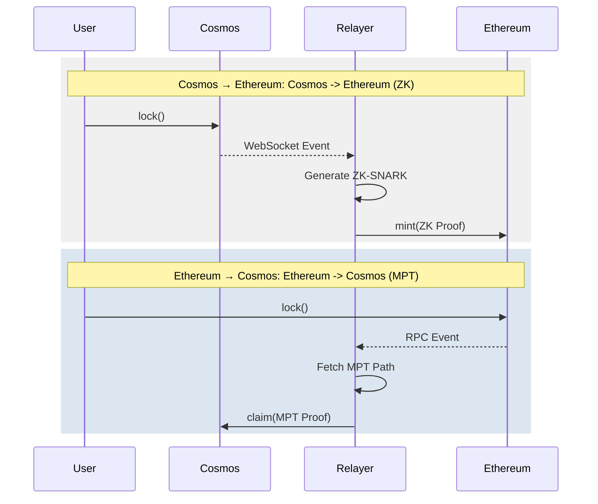

# Cosmos-Eth Bridge: Technical Architecture

This document provides a deep dive into the cryptographic and structural architecture of the bidirectional Cosmos-Eth Bridge between Cosmos (EVM) and Ethereum.

## 1. Unified Project Structure

```
bridge/
├── cmd/                    # Executable commands
│   ├── setup/             # ZK circuit compilation & key generation
│   └── relayer/           # Dual-direction bridge relayer
├── contracts/             # Solidity smart contracts
│   ├── CosmosBridge.sol   # Gateway on Cosmos EVM
│   ├── EthBridge.sol      # Gateway on Ethereum
│   ├── LibMPT.sol         # MPT verification library (for Eth -> Cosmos)
│   ├── Verifier_Transactions.sol  # ZK Transaction Inclusion Verifier
│   ├── Verifier_Validators.sol    # ZK Block Finality Verifier
│   └── Verifier_Transitions.sol   # ZK Valset Transition Verifier
├── pkg/                   # Shared Go packages
│   ├── circuits/          # GNARK ZK-SNARK definitions (Triple-Verifier)
│   ├── prover/            # Proof generation (ZK & MPT)
│   ├── rpc/               # Multi-chain RPC clients
│   └── trie/              # MPT implementation for Go
└── keys/                  # Proving/Verifying keys (Groth16)
```

---

## 2. Asset & Token Flow

The bridge facilitates the transfer of native assets and their wrapped counterparts across chains.

| Chain | Primary Native Asset | Wrapped Asset (from peer) |
|-------|----------------------|---------------------------|
| **Cosmos** | TEST (Native) | Wrapped ETH (WETH) |
| **Ethereum** | ETH (Native) | Wrapped TEST (WTEST) |

- **Locking**: Users escrow native assets (e.g., ETH on Ethereum) to mint wrapped versions on the destination (e.g., WETH on Cosmos).
- **Burning**: Users burn wrapped assets (e.g., WTEST on Ethereum) to unlock the original native assets (e.g., TEST on Cosmos).

---

## 3. Cosmos → Ethereum (ZK-SNARK)

This direction uses **Groth16 ZK-SNARKs** to verify Tendermint Merkle proofs on Ethereum.

### 3.1 Cryptographic Foundation
- **Triple-Verifier Architecture**: The production implementation uses three specialized circuits to ensure security and gas efficiency:
  - **ValidatorCircuit**: Verifies block finality using **Ed25519** signatures and 2/3 voting power quorum.
  - **TransitionCircuit**: Verifies validator set updates through signed set-hashes.
  - **TransactionCircuit**: Verifies Merkle inclusion proofs for specific transactions.

#### Why this approach?
1. **Security (Trust Continuity)**: By separating validator set transitions into its own circuit, we ensure a "cryptographic chain of custody." A new validator set is only trusted if the *previous* trusted set signed its hash. This prevents "long-range attacks" where an attacker could otherwise try to inject a fake validator set.
2. **Gas Efficiency (Amortization)**: 
   - Signature verification (Ed25519 emulation) is extremely expensive on-chain (~200k+ gas). 
   - Instead of verifying signatures for *every* transaction, we verify them once (per block/epoch) to anchor a `trustedRoot`. 
   - Individual transaction proofs then only need to verify a Merkle path against that root, which is significantly cheaper and faster inside a SNARK.
3. **Modular Proving**: Separating circuits reduces the "constraint count" for each individual proof. This results in faster proof generation and lower memory requirements for the relayer/prover compared to a single "God Circuit." To ensure stability, the production relayer uses a **Sequential Prover Mutex** to prevent multiple ZK proving processes from contending for system memory.

- **Proving System**: Groth16 (BN254 curve).
- **Emulated Arithmetic**: Uses non-native emulated arithmetic to verify **Ed25519** signatures (Edwards curve operations) on the BN254 curve.
- **Input Packing**: 32-byte hashes are split into 4x `uint64` (passed as `uint256` field elements) to maintain compatibility between the SNARK field and EVM words.
- **Cryptographic Linking**: The `ValidatorCircuit` enforces a strict link between the signed `BlockHash` and the anchored `DataHash` (transaction root) and `ValidatorsHash` using SHA-512 and SHA-256 inside the circuit.

### 3.2 Deep Dive: The ZK Process

The production bridge uses three distinct circuits to minimize gas costs and maximize security.

#### A. Block Finality (ValidatorCircuit)
This circuit proves that a specific block header is cryptographically finalized by the Cosmos network.
1. **Signature Emulation**: It uses **non-native emulated arithmetic** to verify **Ed25519** signatures (from Tendermint validators) on the BN254 curve used by Ethereum.
2. **Quorum Enforcement**: It iterates through the validator set and calculates `signedPower`. It asserts that `3 * signedPower >= 2 * TotalPower` (the standard 2/3 Tendermint quorum).
3. **Set Integrity**: It hashes the entire validator set (Compressed Public Key + Power) and ensures it matches the public `ValidatorsHash` to prevent "fake" key substitution.

#### B. Validator Set Transitions (TransitionCircuit)
This circuit ensures a secure handover between validator sets.
1. **Consistency**: It verifies that the "Old Set" hash matches the previously trusted state.
2. **Authorization**: It proves that the *new* set hash was authorized (signed) by a 2/3 quorum of the *old* trusted set.

#### C. Transaction Inclusion (ZkBridgeCircuit)
This circuit proves that a specific `TxHash` exists within a confirmed block's `data_hash`.
1. **Hashing Scheme**: It implements Tendermint-style SHA-256 hashing to prevent second-preimage attacks:
   - Leaf Nodes: `SHA256(0x00 || data)`
   - Internal Nodes: `SHA256(0x01 || left || right)`
2. **Variable-Depth Support**: The circuit is built for a max depth of 32. It uses an `ActualDepth` witness and `api.Select` to mask hashing iterations for smaller trees without compromising privacy or increasing gas costs.

#### D. Public Input Packing (Efficiency)
EVM works with 256-bit words, but SNARKs often prefer smaller chunks to avoid field overflow.
- **Unpacking**: 32-byte hashes (Root/TxHash) are split into four 64-bit integers on-chain. The circuit "unpacks" these using bitwise operations to reconstruct the original byte-arrays.
- **Gas Savings**: This packing keeps the number of public inputs low, reducing the "pairing" operation costs in the Solidity verifier.

#### E. Public Input Slots (Transactional)
Public inputs are packed into 64-bit chunks to ensure they fit within the BN254 field modulus without overflow.

| Circuit | Public Inputs | Description |
|---------|---------------|-------------|
| **Validator** | 14 | `ValidatorsHash` (4), `BlockHash` (4), `DataHash` (4), `Height` (1), `TotalPower` (1) |
| **Transition** | 8 | `OldValidatorsHash` (4), `NewValidatorsHash` (4) |
| **Transaction** | 8 | `MerkleRoot` (4), `TxHash` (4) |

The `EthBridge.sol` uses `packTwoHashes` and manual assignment to prepare these inputs for the Solidity verifiers.

---

### 3.3 Ethereum Event Detection
The relayer monitors the following topic hashes on Ethereum to trigger the release of assets on Cosmos:

| Event | Signature | Topic Hash (Hex) |
|-------|-----------|------------------|
| `Locked` | `Locked(address,uint256,string,uint256)` | `0xb754...` |
| `Burned` | `Burned(address,uint256,string,uint256)` | `0xcd51...` |

---

#### High-Level ZK Pipeline
1. **Circuit**: Reconstructs the Merkle tree path using SHA256 (Tendermint-style hashing).
2. **On-Chain**: `EthBridge.sol` calls the respective Verifier contracts (`Verifier_Validators` for headers, `Verifier_Transactions` for inclusion).
3. **Finality**: Successfully verified header proofs update the `trustedRoots`, which then enable the `mint` or `unlock` functions once transaction proofs are verified against them.

#### E. Technical Flow
1. **Sync**: The relayer submits a header proof (`ValidatorCircuit`) to update the trusted block root on Ethereum.
2. **Transition**: If validators change, a `TransitionCircuit` proof is submitted to update the `ValidatorsHash`.
3. **Mint/Unlock**: Once the block root is anchored, specific `ZkBridgeCircuit` proofs are used to verify and process individual bridge transfers.

---

## 4. Ethereum → Cosmos (MPT-Proof)

This direction uses **Merkle Patricia Trie (MPT)** verification, leveraging the fact that Ethereum's `receiptsRoot` is natively verifiable without heavy ZK circuits.

### 4.1 Trustless Verification via LibMPT
Instead of a ZK proof, the relayer provides a raw MPT inclusion proof extracted from the Ethereum transaction receipt.

- **Storage**: The `CosmosBridge.sol` maintains a `trustedEthReceiptRoot` (the `receiptsRoot` of an Ethereum block).
- **Verified Inclusion**: **Payloads are now cryptographically verified on-chain**.
- **Library**: `LibMPT.sol` implements actual Merkle Patricia Trie traversal (Branch, Extension, Leaf nodes) and Keccak256 hash-chain verification.
- **Decoding**: `RLPReader.sol` is used to decode the Ethereum receipt, ensuring the `Locked` or `Burned` event signature and emitter address are valid before minting/unlocking assets.
- **Node Hashing**: Every intermediate hash in the proof MUST match the child pointer of the previous node, starting from the `trustedEthRoot`.

### 4.2 Behind the Scenes: The Verification Pipeline

The Ethereum -> Cosmos bridge performs a multi-stage cryptographic check inside **CosmosBridge.sol** to ensure no invalid assets are minted:

#### Stage 1: Inclusion Verification (`LibMPT.sol`)
1. **The Trust Anchor**: The relayer periodically updates the `trustedEthReceiptRoot` on Cosmos. This root represents the state of ALL transactions in a specific Ethereum block.
2. **Path Finding**: The relayer provides the RLP-encoded index of the transaction (the "Key").
3. **The Walk**: `LibMPT` starts at the `trustedEthReceiptRoot` and performs a hash-chain walk through the provided proof nodes. It verifies every step:
   - For a **Branch Node**, it selects the child hash matching the current nibble of the key.
   - For an **Extension Node**, it validates the partial path prefix.
   - It hashes every node (`keccak256`) and ensures it matches the pointer from the parent.
4. **Result**: If the walk is valid, it returns the raw, RLP-encoded Ethereum Receipt.

#### Stage 2: Payload Analysis (`RLPReader.sol`)
Once the raw receipt is isolated, it must be "decoded" to verify the payload:
1. **EIP-2718 Handling**: Modern Ethereum uses typed receipts (Type 1/2/3). The verifier detects these by checking if the first byte is `< 0x80`. If so, it strips the type byte to expose the actual RLP payload.
2. **List Parsing**: `RLPReader` parses the receipt list to find the `logs` array (index 3).
3. **Event Filtering**: It iterates through the logs to find one that matches:
   - **Emitter**: The log MUST come from the specific address of the `EthBridge` contract.
   - **Topic**: The first topic MUST be the Keccak256 hash of the `Locked()` or `Burned()` event signature.
   - **Data**: It extracts the amount and recipient from the log data and verifies they match the user's claim.

### 4.3 Relayer Operations & Persistence
The relayer manages the lifecycle of these proofs:
- **Block Tracking**: It maintains a `last_eth_block.txt` file to ensure that even after a restart, it picks up exactly where it left off, avoiding duplicate proof calculations.
- **WebSocket Sync**: It uses real-time event monitoring on Cosmos while using persistent polling on Ethereum to guarantee reliability.



### 4.4 Comparison of Mechanisms

| Feature | Cosmos -> Ethereum | Ethereum -> Cosmos |
|---------|-------------------|-------------------|
| **Proof Type** | ZK-SNARK (Groth16) | MPT Inclusion Proof |
| **Verifier** | `Verifier.sol` (Generated) | `LibMPT.sol` (Static) |
| **Trust Anchor** | Block `data_hash` | Block `receiptsRoot` |
| **Gas Cost** | Constant (~250k gas) | Linear to proof depth |
| **Complexity** | High (Circuit based) | Medium (RLP decoding) |

---

## 5. Key Design Decisions

### 5.1 Keccak256 Alignment
To avoid "cross-chain friction," the Go prover and Solidity contracts are strictly aligned on Keccak256. This is used for generating field elements from hashes (Hash-to-Field) within the Solidity verifier, ensuring that cryptographic commitments (if used in future) or intermediate hashes match Ethereum's native `keccak256` opcode.

### 5.2 Robust Path Resolution
All binaries (setup, relayer) implement dynamic path detection. By locating `go.mod`, they resolve the project root, ensuring that `keys/` and `contracts/` are accessible regardless of the execution context.

### 5.3 Automated Root Synchronization (The "Synchronizer" Pattern)
The relayer acts as a "Trust Synchronizer":
- **Detection**: It monitors block headers and events on both chains.
- **Sync**: Before submitting a bridge proof, it ensures the destination contract's `ValidatorsHash` and `trustedRoot` are up-to-date using `updateValidatorSet` and `verifyHeader`.
- **Mechanism (Production)**: In this production version, the relayer submits ZK proofs that the contract verifies cryptographically. The "Admin" update model is replaced by fully trustless, in-circuit validator set and header verification.

---

## 6. Security & Protection

- **Replay Protection**: Both contracts maintain a `processedTxs` mapping to ensure each cross-chain transaction is handled exactly once.
- **Double-Spending**: Assets are only released (minted/unlocked) if a valid cryptographic proof (ZK or MPT) is provided.
- **Sequential Height Enforcement**: The `EthBridge` contract maintains a `lastProcessedHeight`. Every header sync must be for a height strictly greater than the current state, preventing "long-range" attacks.
- **Finality Threshold**: To prevent reorg attacks, the relayer enforces a **2-epoch wait (~13 mins)** for Ethereum events and a **3-block wait** for Cosmos events before generating proofs.
- **Validator Set Trust**: Trust is maintained cryptographically via the **TransitionCircuit**, ensuring every validator set change is signed by the previous set.
- **Production Path**: A fully trustless bridge requires:
  - **EVM-Light Client**: To verify Ethereum PoS headers on Cosmos.
  - **ZK-Light Client**: To verify Tendermint header consensus on Ethereum.

### 6.2 Governance & Scalability FAQ

**Q: What happens if the Cosmos validator set size changes via a governance proposal?**

1.  **Hard Limit**: The ZK circuit is compiled with a fixed `MaxValidators` capacity. This is a cryptographic constraint of the Groth16 proof system.
2.  **Failure Mode**: If the actual validator set size on Cosmos exceeds the circuit's `MaxValidators`, the proving process will fail because the circuit cannot accommodate the additional public keys or voting power weights.
3.  **Upgrade Process**:
    - **Step 1**: Update the `MAX_VALIDATORS` environment variable to the new required capacity.
    - **Step 2**: Re-run the setup command (`go run cmd/setup/main.go`) to generate new proving/verifying keys and an updated `Verifier_Validators.sol`.
    - **Step 3**: Deploy the new verifier contract on Ethereum.
    - **Step 4**: Update the `EthBridge` contract with the new verifier address. This ensures the bridge remains trustless while scaling to meet the new network requirements.
4.  **Optimization Recommendation**: For production deployments, it is recommended to set `MaxValidators` to a generous upper bound (e.g., 25% higher than the current set) to allow for growth without immediate re-keying.
