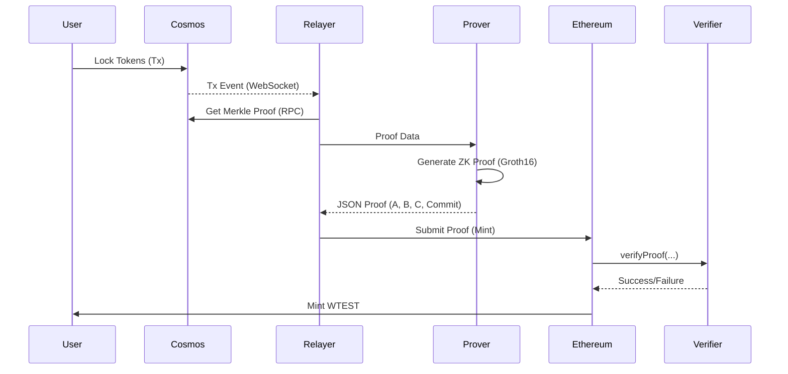

# Architecture Overview

## Project Structure

```
zk-bridge/
├── cmd/                    # Executable commands
│   ├── setup/             # ZK circuit compilation & key generation (Keccak256)
│   ├── deployer/          # Contract deployment tool
│   └── relayer/           # Bridge relayer service
├── contracts/             # Solidity smart contracts
│   ├── BridgeSource.sol   # Lock tokens on Cosmos
│   ├── BridgeDestination.sol  # Mint tokens on Ethereum
│   └── Verifier.sol       # ZK proof verifier (generated by setup)
├── pkg/                   # Shared Go packages
│   ├── circuits/          # GNARK circuit definitions
│   ├── prover/            # Proof generation logic
│   └── rpc/               # RPC client implementations
├── keys/                  # Generated cryptographic keys
│   ├── proving.key        # For proof generation
│   └── verifying.key      # For verification
└── guides/                # Documentation
```

## Technical Deep Dive: The ZK Process

### 1. Cryptographic Foundation
The bridge utilizes **Groth16**, the most efficient ZK-SNARK proving system for on-chain verification. It is implemented over the **BN254** (alt_bn128) pairing-friendly elliptic curve, which is natively supported by Ethereum via precompiled contracts.

- **Curve**: BN254 (Field size $\approx 2^{254}$)
- **Proving System**: Groth16 (Constant proof size: 3 G1/G2 points)
- **Framework**: GNARK (R1CS backend)

### 2. Merkle Tree Implementation (Tendermint Style)
Unlike standard Ethereum Merkle trees, Tendermint uses a specific hashing scheme to prevent parity attacks (second-preimage attacks):
- **Leaf Nodes**: Hashed as `SHA256(0x00 || data)`
- **Internal Nodes**: Hashed as `SHA256(0x01 || left || right)`

#### Circuit Logic: Variable-Depth Support
The circuit is designed for a maximum depth of 32 (standard for Tendermint). To handle transactions at different depths without revealing the exact depth (privacy) or bloating the circuit (efficiency), we use a **Masking/Selection** strategy:
1. The circuit always performs 32 hash iterations.
2. An `ActualDepth` variable (private) determines when the hashing is "active".
3. `api.Select` logic masks dummy inputs if the current iteration index exceeds `ActualDepth`.
4. This ensures a constant number of constraints regardless of the proof length.

### 3. Pedersen Commitments & Witness Reduction
To reduce the number of public inputs (which are expensive in gas), we leverage **Gnark's Native Commitments**:
- **Problem**: Passing a 32-level proof path as public inputs would cost millions of gas.
- **Solution**: We treat the Merkle Path as **private witnesses** and "commit" to them.
- **Mechanic**: The prover generates a Pedersen Commitment to the private wires. A small challenge is derived using a transcript (Fiat-Shamir). 
- **Hash Alignment**: We explicitly configure the commitment challenge to use **Keccak256**. This ensures that the Solidity verifier can verify the commitment using Ethereum's native `keccak256` opcode, staying perfectly synchronized with the Go prover.

### 4. Public Input Packing
Ethereum's EVM works with 256-bit words, but GNARK circuits often work better with smaller chunks to avoid field overflow issues. We use a **4x uint64 packing** strategy:
- **32-byte Value (Root/TxHash)** is split into four 64-bit unsigned integers.
- **Solidity Side**: `BridgeDestination.sol` implements `getPackedInputs` to reconstruct these 4x uint64s from the `bytes32` hash using bitwise shifts.
- **Circuit Side**: An `unpack` function converts these uint64s into a bit-array and then into 32 individual bytes for SHA256 processing.

### 5. On-Chain Verification (`Verifier.sol`)
The generated `Verifier.sol` executes a 4-pairing check:
$$e(A, B) \cdot e(C, \text{vk}_2) \cdot e(\text{inputs}, \gamma) \cdot e(X_{commit}, \delta) = 1$$

It utilizes three Ethereum precompiles:
1. **ECADD (0x06)**: For combining public inputs in the G1 scalar multiplication.
2. **ECMUL (0x07)**: For scaling verification key points by public input values.
3. **ECPAIRING (0x08)**: To perform the final G1/G2 bilinear pairing check.

## Component Architecture

### 1. ZK Circuit (`pkg/circuits/`)
- Implements the `Define` method for R1CS generation.
- Uses `std/hash/sha2` for inside-circuit SHA256 computations.
- Total constraints are $\approx 1.8$ million, optimized for high-performance proving.

### 2. Setup (`cmd/setup/`)
- Compiles the Go circuit into R1CS.
- Performs the trusted setup and saves `proving.key` / `verifying.key`.
- Exports `Verifier.sol` with the Keccak256 transcript configuration.

### 3. Prover (`pkg/prover/`)
- Queries Cosmos RPC for transaction inclusion proofs.
- Translates Cosmos `Aunts` (path) into the circuit witness format.
- Generates the Groth16 proof + Pedersen Commitment evidence.

### 4. Relayer (`cmd/relayer/`)

Monitors and relays cross-chain messages:
- Subscribes to Cosmos transaction events
- Detects lock events on BridgeSource
- Generates inclusion proofs
- Submits proofs to BridgeDestination

### 5. Smart Contracts

**BridgeSource (Cosmos EVM)**
- `lock(address recipient, uint256 amount)` - Lock tokens for bridging
- Emits `Locked` event with recipient and amount

**BridgeDestination (Ethereum)**
- `mint(proof, root, txHash, recipient, amount)` - Verify proof and mint
- Maintains trusted Merkle root
- Prevents replay attacks via processed tx tracking

**Verifier (Ethereum)**
- `verifyProof(proof, commitments, input)` - Verify Groth16 proof
- Auto-generated from circuit
- Patched to use SHA256 with compressed points

## Data Flow



## Security Model

- **Trustless Execution**: No central authority is required to relay proofs; any actor can submit a valid ZK-SNARK to trigger the release of funds.
- **ZK Privacy & Soundness**: The proof reveals no underlying path data (privacy) while cryptographically ensuring the existence of the lock event (soundness).
- **Double-Spending & Replay Protection**: Prevented via a global `processedTxs` mapping in `BridgeDestination`, ensuring each Cosmos transaction hash can be bridged exactly once.
- **Root Trust**: In this POC, the relayer updates the trusted Merkle root. Production versions would replace this with a **ZK Consensus Light Client** for a fully decentralized root sync.
- **Proof-of-Knowledge**: Pedersen Commitments ensure the prover actually "knows" the Merkle path they claim, preventing malicious attempts to fake inclusion proofs.

## Key Design Decisions

### Path Resolution
All tools use robust path detection:
- Check for `go.mod` to determine the project root.
- Dynamically resolves paths to `keys/` and `contracts/` regardless of where the binary is executed.
- Prevents "file not found" errors during proof generation.

### Environment Configuration
Relayer uses `.env` file for all configuration:
- No hardcoded addresses or private keys.
- Facilitates easy deployment across different testnets and local environments.
- Securely isolates sensitive credentials from the source code.

### Modular Architecture
- **pkg/circuits**: Pure GNARK logic, free of external dependencies.
- **pkg/prover**: High-level API for witness building and proof generation.
- **pkg/rpc**: Clean abstractions for Cosmos/EVM state retrieval.
- **cmd/**: Lightweight wrappers that orchestrate the packages.
